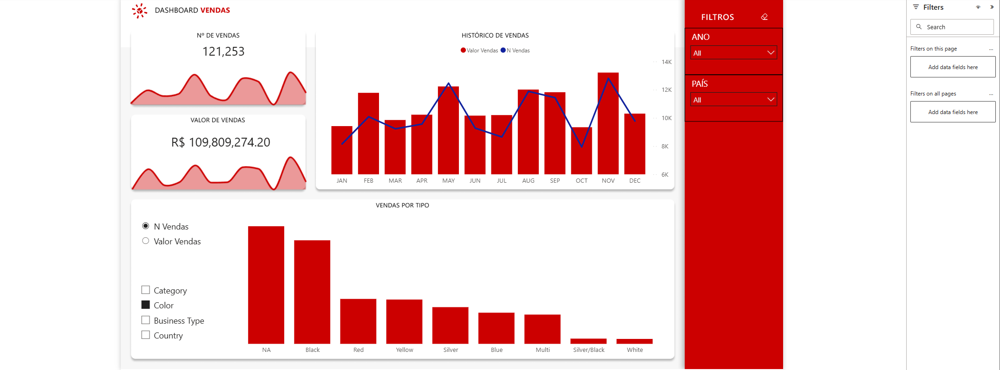

# Power BI Dashboard - Sales

This repository contains a **sales dashboard** created in Power BI Desktop, developed as a portfolio project to showcase skills in data analysis and visualization.

## Dashboard Objective
The dashboard aims to:
- Monitor sales by region, product, and period.
- Identify revenue trends and product performance.
- Support decision-making through clear and interactive KPIs.

## Key Metrics and Visuals
- **Total Sales:** overview of revenue by period.
- **Sales by Product:** comparative chart of top-selling products.
- **Sales by Region:** map or chart showing regional performance.
- **Monthly Trends:** sales evolution over time.
- **Key KPIs:** indicators such as growth, average sales, and target achievements.

## How to Open the Dashboard
1. Download the `.pbix` file [download link].
2. Open it in **Power BI Desktop** (recommended version: 2023 or later).
3. Refresh the data if needed (for external sources).

## Data Sources
- Sample/fake data created for study and demonstration purposes.

## Dashboard Screenshots

Created by [Luan Carlos]
